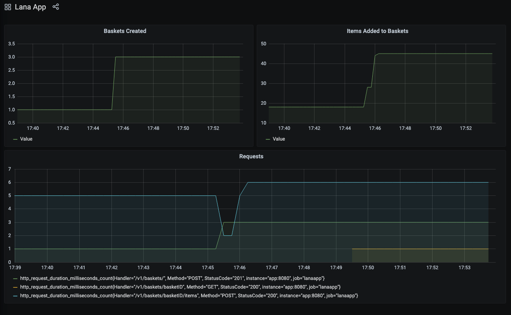
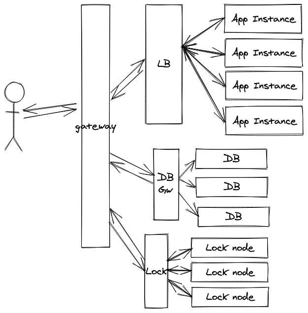

# Lana - Backend Challenge

## Index
- [Problem](#problem)
- [How to run](#how-to-run)
- [Architecture](#architecture)
- [Storage](#storage)
- [Lock](#lock)
- [Endpoints](#endpoints)
    - [Postman Collection](#postman-collection)
- [Testing](#testing)
- [Monitoring](#monitoring)
- [Profiling](#profiling)
- [Scalability](#scalability)
- [API Examples](#api-examples)

---
### Problem

Solution to [lana back-end challenge](https://github.com/lana/backend-challenge)

---
### How to run

Dockerfile and Docker Compose are provided.

#### Dockerfile

To run only the app execute the following commands:

1. `docker build . -t lanaapp` to build the docker image
2. `docker run -p 8081:8080 lanaapp` to run the app

The app will run at [http://localhost:8081](http://localhost:8081). See available [endpoints](#endpoints) and [example requests](#api-examples).

#### Docker Compose

The docker compose configuration allows us to run the app along with [Prometheus](https://prometheus.io/) and [Grafana](https://grafana.com/) for metrics and monitoring.

To run execute the following commands:

1. `cd docker-compose &&  docker-compose up -d`

This will get the apps running:
- Lana App: http://localhost:8081/
- Prometheus: http://localhost:8082/
- Grafana: http://localhost:8083/
    - [Lana App Dashboard](http://localhost:8083/d/x1KdtCKGz/lana-app?orgId=1&refresh=5s&from=now-15m&to=now) 

---
### Architecture

The project structure is based on [Domain Driven Design(DDD)](https://martinfowler.com/bliki/DomainDrivenDesign.html) and [Hexagonal architecture](https://en.wikipedia.org/wiki/Hexagonal_architecture_(software)).

More info on hexagonal architecture & Go:
- https://www.youtube.com/watch?v=vKbVrsMnhDc
- https://medium.com/@matiasvarela/hexagonal-architecture-in-go-cfd4e436faa3

I chose this approach because allows us the decouple the app components and facilitates the evolution of the app. The domain logic is agnostic to all the external resources(database, external services like distributed locks, other API, etc...) and even how that logic is accessed(REST, gRPC, command line, etc...). This is achieved with separations of concerns and interfaces.

#### Dependencies

Only a minimal set of [dependencies](go.mod) are used:
- `github.com/go-chi/chi` as router 
- `github.com/google/uuid` to generate resource ID
- `github.com/prometheus/client_golang` Prometheus client
- `github.com/stretchr/testify` as testing framework
- `gopkg.in/yaml.v2` for configuration files

---
### Storage

As per expressly requested on the challenge description no external database has been use. I implemented a basic [in-memory storage](internal/repository/storage/storage.go) with mutex locking on each resource to allow concurrency.

If we wanted to change the storage of the app for,let's say, an external database like PostgreSQL with connection pooling we only need to implement the interface [Storage](internal/domain/checkout/container.go) for that particular database and inject the new implementation in the [container initialization](cmd/container/container.go).

---
### Lock

On distributed system is common to use a distributed lock to ensure operations consistency. Given that we are only using a in-memory database and one instance I implemented an [in-memory lock](internal/repository/locker/lock.go) with a map with a very simple retry strategy(3 attempts, every 100ms). Even when the database permit multiple operations on the same resource at a domain level the lock is used to modify a basket.

For example if we have concurrent requests to add and item to the basket and delete the basket, the operations will be executed in a serial manner. If delete happen first the add item request will return 404 because the basket no longer exists. If the item is added first, the basket will be successfully deleted after that. 

In a real scenario something like Redis, Zookeeper, DynamoDB, etc should be used.

---
### Endpoints

REST interface was used to access the app. Could be also gRPC o GraphQL. With the implemented architecture how the app is served can be easily changed without touching the domain logic.

The app exposes these endpoints. All are available on the same port but metrics and profiling are usually in different ports for security reasons.

A note on API versioning. I'm using the common URI versioning approach, but could be by header version, query param, accept header, domain, etc.

- **Profiling**
  - /debug
  - /debug/pprof
  - /debug/pprof/cmdline
  - /debug/pprof/profile
  - /debug/pprof/symbol
  - /debug/pprof/trace
  - /debug/vars

- **Prometheus Metrics**  
  - /metrics

- **App**
  - /ping [GET]
  - /v1/baskets/ [POST] (Create a Basket)
  - /v1/baskets/{basketID} [GET] (Get Basket details)
  - /v1/baskets/{basketID} [DELETE] (Delete basket)
  - /v1/baskets/{basketID}/items [POST] (Add Item to Basket)
  - /v1/baskets/{basketID}/items/{productID} [DELETE] (Remove Item from Basket)
  - /v1/products/ [GET] (Get product list)
  - /v1/products/{productID} [GET] (Get a product)
  
See [API requests examples](#api-examples).

#### Postman Collection
A postman collection is available to test the API.

See: [doc/postman/lana-challenge.json](doc/postman/lana-challenge.json)

---
### Testing

Tests can be run with `make test` or `go test ./... -covermode=atomic -count=1 -race`.

The unit test coverage on /internal package is 100%. [Functional tests](test/functional/functional_test.go) are available as well.

---
### Monitoring

Monitoring is not requested nor mentioned on the challenge description, but I consider monitoring and observability as a must feature in every application. For this app I created a [metrics interface](internal/repository/metrics/metrics.go) that is injected in a [middleware](internal/rest/middleware.go) to track requests and in the context to be use for custom metrics like the counter of basket created and items added. An [implementation of that interface for Prometheus](internal/repository/metrics/prometheus/prometheus.go) is available. Grafana was used to created a dashboard with Prometheus as data source.

Once again the internals of how the metrics interface is implemented are separated of the domain logic and we can create a Datadog implementation and use that implementation without touching the domain.

In this case the metrics interface is in the same app but could be an external library used by all apps to standardize how metrics are gathered.

A `/ping` endpoint is available for instances health check.

The only purpose of the dashboard is to show a simple metric implementation and besides the few metrics on it is far from a useful production dashboard.

Dashboard screenshot:



---
### Profiling

[Profiling](https://blog.golang.org/pprof) endpoint is available on `/debug` and can be used to analize how the app is working, find memory leaks, poorly performing code and more.

---
### Scalability

In a real application the app cloud architecture could be something like this. Using a load balancer to handle multiple app instances, a separate database with master and replicas(slaves) or with a sharding approach. An external distributed lock would be used and the access to the app could by and nginx gateway.



---
### Api Examples

#### Create a basket

`curl --location --request POST 'localhost:8081/v1/baskets'`

Response:

```
HTTP/1.1 201 Created
Content-Length: 141
Content-Type: application/json; charset=utf-8
Date: Sun, 04 Oct 2020 23:24:17 GMT

{
    "created_at": "2020-10-04T20:24:17.437613-03:00",
    "discount": 0,
    "id": "a93cffeb-205b-4f27-9e66-8efd735b5364",
    "items": {},
    "subtotal": 0,
    "total": 0
}
```

#### Add items to basket

```
curl --location --request POST 'localhost:8081/v1/baskets/9970a992-42b8-4a33-842c-4319d59a3040/items' \
--header 'Content-Type: application/json' \
--data-raw '{
    "id": "PEN",
    "quantity": 53
}'
```

Response:

```
HTTP/1.1 200 OK
Content-Length: 0
Date: Sun, 04 Oct 2020 23:25:21 GMT
```

#### Remove items from basket

`curl --location --request DELETE 'localhost:8081/v1/baskets/9970a992-42b8-4a33-842c-4319d59a3040/items/PEN?quantity=1'`

Reponse:

```
HTTP/1.1 200 OK
Content-Length: 0
Date: Sun, 04 Oct 2020 23:26:53 GMT
```

#### Get basket details

`curl --location --request GET 'localhost:8080/v1/baskets/9970a992-42b8-4a33-842c-4319d59a3040'`

Response:

```
HTTP/1.1 200 OK
Content-Length: 276
Content-Type: application/json; charset=utf-8
Date: Sun, 04 Oct 2020 23:27:26 GMT

{
    "created_at": "2020-10-04T20:23:04.795341-03:00",
    "discount": 130,
    "id": "9970a992-42b8-4a33-842c-4319d59a3040",
    "items": {
        "PEN": {
            "discount": 130,
            "product": {
                "id": "PEN",
                "name": "Lana Pen",
                "price": 5,
                "promotion_id": "BUY2GET1FREE"
            },
            "quantity": 52,
            "total": 260
        }
    },
    "subtotal": 260,
    "total": 130
}
```

#### Delete basket

`curl --location --request DELETE 'localhost:8081/v1/baskets/9970a992-42b8-4a33-842c-4319d59a3040'`

Response:

```
HTTP/1.1 200 OK
Content-Length: 0
Date: Sun, 04 Oct 2020 23:28:25 GMT
```

#### Get product list

`curl --location --request GET 'localhost:8081/v1/products'`

Response:

```
HTTP/1.1 200 OK
Content-Length: 223
Content-Type: application/json; charset=utf-8
Date: Sun, 04 Oct 2020 23:30:30 GMT

[
    {
        "id": "PEN",
        "name": "Lana Pen",
        "price": 5,
        "promotion_id": "BUY2GET1FREE"
    },
    {
        "id": "TSHIRT",
        "name": "Lana T-Shirt",
        "price": 20,
        "promotion_id": "BUY3+GET25OFF"
    },
    {
        "id": "MUG",
        "name": "Lana Coffee Mug",
        "price": 7.5,
        "promotion_id": null
    }
]
```